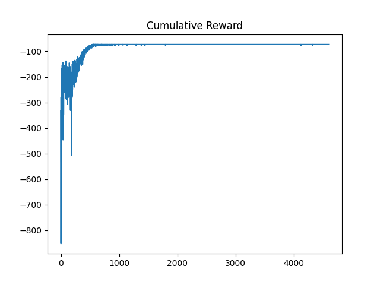
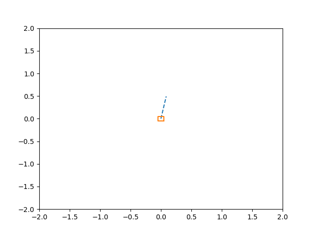
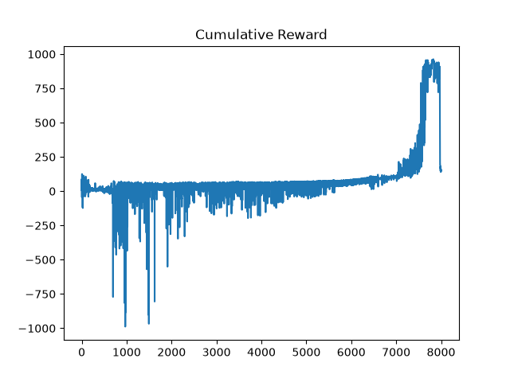
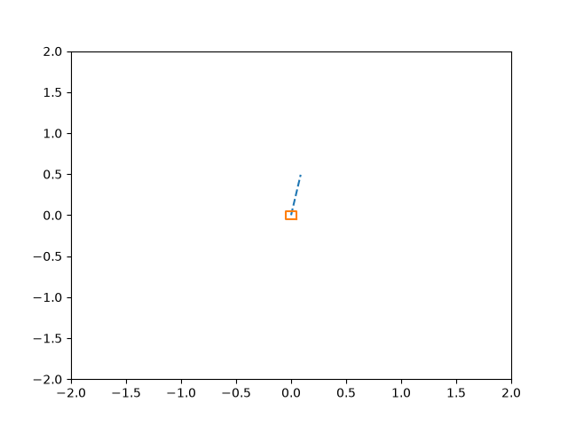
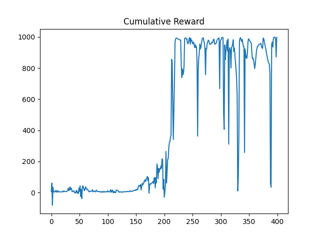
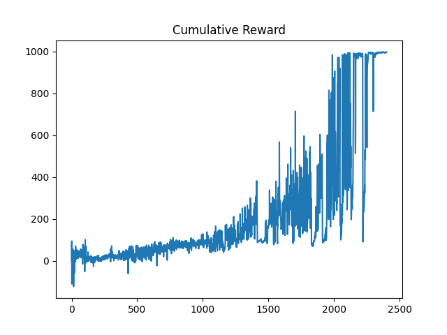
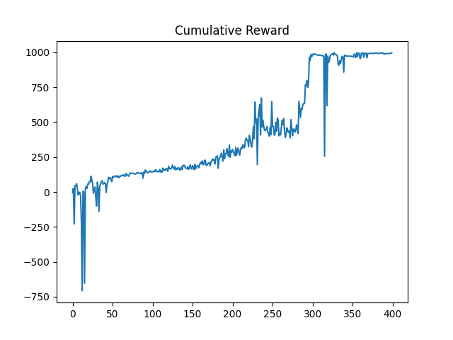

# Cart Pole Reward Design
One of the most important observations that I have is the effect of the reward on the performance (which makes sense). The following figure shows the cumulative reward during each episode for the cart pole environment where the policy is trained using one step A2C algorithm. The reward in this case is going to be -1 for all the states, except when the pole is upright ($\theta$ is less than 0.1 rad). When the pole is upright the reward is 1. The other point is that I terminate the episode if the agent x value goes beyond 2. I truncate when the agent is spending more than 12000 steps. Also, I terminate if the agent is in the upright position for more than 10000 steps. It can be seen that the policy only learns to 

I changed the reward to $r = \cos{\theta} + 0.1x^2 + 0.001 \dot{x}^2 + 0.001 \omega^2 + 0.0001 u^2$, also I changed the policy to a continuous policy that outputs the probability districution of the action. The following figures show the results

I got the best results by DDPG:

PPO results are shown below:

SAC results are shown below:

